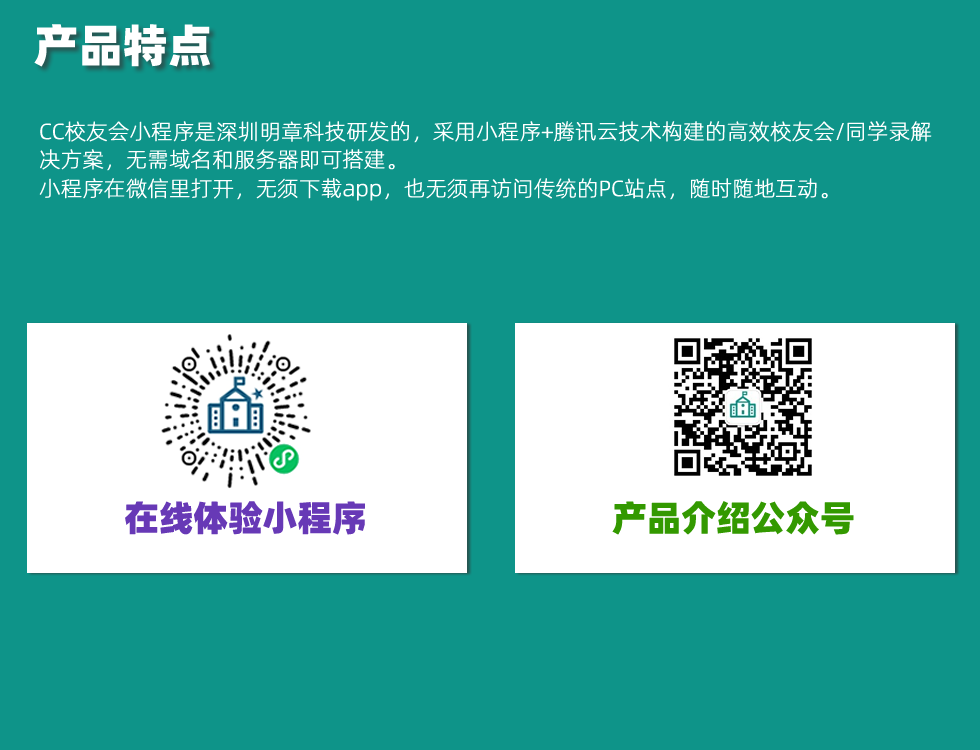

 
# 项目介绍

- CC校友会小程序 是深圳明章科技公司研发的，采用小程序+腾讯云技术构建的高效校友会/同学录解决方案，无需域名和服务器即可搭建。
一键开通，十分钟上线
- 小程序在微信里打开，无须下载app，也无须再访问传统的PC站点，随时随地互动。

- 校友登记系统：方便的登记专业，院系，入学毕业年份，工作单位，职称职务，联系方式等信息，并可设定上传毕业照等补充材料，方便校友身份审核，并可方便的导出为Excel文档
- 互助模块：可以发布自己的供求，商品，招聘，企业，招商，合作等信息 
- 找校友模块：按专业，企业，级别等多条件搜索功，提供详实的校友个人主页；有意向的校友可以交换名片，双方同意之后即可查看联系方式功能，保护隐私
- 校友活动模块: 可以发起校友聚会，设定时间，地点，报名日期，并可进行在线报名和现场扫码签到
- 资讯模块：发布校友新闻，母校资讯，推介校友企业，发布各地校友动态，亦可自定义资讯模块栏目
- 相册模块：瀑布流形式展示美好的青葱岁月
- 分享模块：活动，互助，聚会，支持分享小程序卡片到微信朋友圈；支持生成并分享带有小程序码的海报，邀请更多校友加入
- 后台管理模块：独创性的研发了小程序端后台管理系统，你可以通过手机，随时随地的管理您的校友录数据，审核用户，发布新资讯等。
- 群助手，私信，收藏，点赞，评论，足迹，消息提醒等更多功能可以查看我们的公众号里的产品介绍
 
 
# 在线体验
 

# 联系我们
 

# 典型案例

# 功能亮点

### 校友登记注册模块
校友方便的登记专业，院系，入学毕业年份，工作单位，职称职务，联系方式等信息，并可设定上传毕业照等补充材料，方便校友身份审核，并可方便的导出为Excel文档

### 互助模块
校友可以发布自己的供求，商品，招聘，企业，招商，合作等信息
 

### 找校友模块
按学院专业，企业，入学与毕业年份等多条件搜索功，提供详实的校友个人主页；有意向的校友可以交换名片，双方同意之后即可查看联系方式功能，保护隐私

### 校友活动模块
校友可以发起校友聚会，设定时间，地点，报名日期，并可进行在线报名和现场扫码签到

### 资讯模块
发布校友新闻，母校资讯，推介校友企业，发布各地校友动态，亦可自定义资讯模块栏目

### 校友相册模块
瀑布流形式展示美好的青葱岁月

### 后台管理模块
 独创性的研发了小程序端后台管理系统，你可以通过手机，随时随地的管理您的校友录数据，审核用户，发布新资讯等
 

### 其他模块
- 私信，收藏，点赞，评论，足迹，消息提醒等更多功能可以查看我们的公众号里的产品介绍
- 分享模块：活动，互助，聚会，支持分享小程序卡片到微信朋友圈；支持生成并分享带有小程序码的海报，邀请更多校友加入

# 联系我们
 

 

 

 